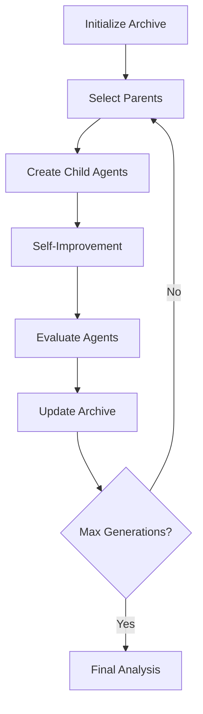

# DGM-Chess Process Documentation

## Overview

This document provides a complete step-by-step breakdown of the Darwin-Gödel Machine chess evolution process, from initialization to agent evaluation.

## Table of Contents

1. [System Architecture](#system-architecture)
2. [Initialization Process](#initialization-process)
3. [Evolution Loop](#evolution-loop)
4. [Self-Improvement Process](#self-improvement-process)
5. [Evaluation Pipeline](#evaluation-pipeline)
6. [Tool Integration](#tool-integration)
7. [Data Management](#data-management)
8. [Monitoring & Logging](#monitoring--logging)

---

## System Architecture

### Component Overview

```
DGM-Chess System
├── chess_dgm_outer.py          # Main evolution loop
├── chess_self_improve.py       # Agent self-modification
├── chess_agent.py              # Enhanced chess agent
├── evaluation/
│   ├── staged_evaluation.py    # 3-stage evaluation system
│   └── engine_games.py         # Stockfish game evaluation
├── utils/
│   ├── parent_selection.py     # Paper-exact selection algorithm
│   ├── agent_management.py     # Agent lifecycle management
│   └── puzzle_tracker.py       # Prevent puzzle reuse
├── tools/
│   ├── chess_position.py       # Position analysis
│   ├── chess_moves.py          # Move generation/validation
│   ├── lichess_puzzle.py       # Puzzle fetching
│   ├── bash.py                 # System commands
│   └── edit.py                 # File operations
├── prompts/
│   ├── deepseek_tooluse_prompt.py  # Enhanced prompts
│   └── chess_improvement_prompt.py # Self-modification prompts
└── archive/                    # Agent storage
    ├── initial/                # Generation 0 agent
    ├── gen1_agent0_*/          # Generation 1 agents
    └── gen2_agent0_*/          # Generation 2 agents...
```

### Data Flow



---

## Initialization Process

### Step 1: System Setup

**File: `chess_dgm_outer.py`**
```python
class ChessDGMEvolution:
    def __init__(self, max_generations=80, parallel_agents=2):
        self.max_generations = 80           # Paper-specified
        self.parallel_agents = 2            # Hardware-constrained
        self.parent_selector = ChessParentSelector(k_parallel=2)
        self.agent_manager = ChessAgentManager()
        self.evaluator = ChessStagedEvaluation()
        self.archive = []                   # Population storage
```

### Step 2: Initial Agent Creation

**Process**:
1. Create `archive/initial/` directory
2. Copy base agent files:
   - `chess_agent.py` (enhanced with tool creation)
   - `tools/` directory (5 chess-specific tools)
   - `requirements.txt`
3. Initialize agent metadata:
   ```json
   {
     "agent_id": "initial",
     "parent_id": null,
     "generation": 0,
     "created_at": "2025-01-16T10:30:00",
     "performance": 0.0,
     "functioning_children_count": 0
   }
   ```

### Step 3: Initial Agent Evaluation

**File: `evaluation/staged_evaluation.py`**

```python
# Stage 1: Basic Functionality (10 puzzles, rating 800-900)
stage1_result = {
    'passes': True/False,           # 80% legal moves + 20% accuracy
    'legal_move_rate': 0.85,
    'accuracy': 0.25,
    'results': [...]                # Individual puzzle results
}

# Stage 2: Extended Evaluation (50 puzzles, rating 800-1000)  
stage2_result = {
    'accuracy': 0.42,               # Primary performance metric
    'advances_to_games': True,      # If accuracy >= 40%
    'results': [...]
}

# Stage 3: Engine Games (if qualified)
stage3_result = {
    'win_rate': 0.15,               # Against reduced-strength Stockfish
    'games_played': 10,
    'results': [...]
}
```

### Step 4: Archive Initialization

```python
self.archive.append({
    'agent_id': 'initial',
    'performance': initial_results['final_performance'],  # Stage 2 accuracy
    'functioning_children_count': 0,
    'generation': 0,
    'evaluation_results': initial_results
})
```

---

## Evolution Loop

### Generation Lifecycle

**For generations 1 through 80:**

#### Phase 1: Parent Selection

**File: `utils/parent_selection.py`**

```python
def select_parents(self, archive):
    # Paper-exact algorithm implementation
    parents = []
    
    # Calculate selection probabilities
    for agent in archive:
        performance = agent['performance']
        children_count = agent['functioning_children_count']
        
        # Probability proportional to performance + children bonus
        probability = performance + (children_count * 0.1)
    
    # Sample k_parallel parents with replacement
    selected = weighted_sample(archive, probabilities, k=self.k_parallel)
    return [agent['agent_id'] for agent in selected]
```

#### Phase 2: Parallel Agent Creation

**File: `utils/agent_management.py`**

```python
def run_parallel_improvements(self, selected_parents, generation):
    with ThreadPoolExecutor(max_workers=self.parallel_agents) as executor:
        futures = []
        
        for i, parent_id in enumerate(selected_parents):
            # Create new agent directory: gen{N}_agent{i}_{timestamp}
            new_agent_id = self.agent_manager.create_new_agent(
                parent_id, generation, i
            )
            
            # Submit self-improvement task
            future = executor.submit(
                self.improve_single_agent, parent_id, generation, i
            )
            futures.append(future)
        
        # Collect results with timeout (1 hour per agent)
        for future in as_completed(futures):
            result = future.result(timeout=3600)
```

#### Phase 3: Agent Directory Structure

**Created for each new agent:**
```
archive/gen1_agent0_143052/
├── chess_agent.py              # Copied from parent
├── tools/                      # Inherited + potentially new tools
│   ├── bash.py
│   ├── edit.py  
│   ├── chess_position.py
│   ├── chess_moves.py
│   ├── lichess_puzzle.py
│   └── [agent_created_tools.py]   # Created during evolution
├── requirements.txt
├── metadata.json               # Agent tracking info
└── logs/                       # Self-improvement logs
    ├── improvement_prompt.txt
    ├── improvement_response.txt
    └── validation_results.json
```

---

## Self-Improvement Process

### Detailed Self-Modification Pipeline

**File: `chess_self_improve.py`**

#### Step 1: Performance Analysis

```python
def self_improve_agent(self, agent_id, parent_id):
    # Load agent
    agent = ChessAgent(agent_dir=f"archive/{agent_id}")
    
    # Evaluate current performance  
    evaluation_results = self.evaluator.evaluate_agent(agent, agent_id)
    
    # Safety check: Must pass basic functionality
    if not evaluation_results['stage1']['passes']:
        return False  # Agent eliminated
```

#### Step 2: Failure Data Collection

```python
def collect_failure_data(self, evaluation_results):
    failed_puzzles = []
    
    # Extract from Stage 1 failures
    for result in evaluation_results['stage1']['results']:
        if not result.get('is_correct', False):
            failed_puzzles.append({
                'id': result['puzzle_id'],
                'fen': result.get('fen'),
                'agent_move': result.get('suggested_move'),
                'correct_moves': self.get_puzzle_solution(result['puzzle_id']),
                'agent_reasoning': result.get('agent_response'),
                'rating': result.get('rating', 800),
                'themes': result.get('themes', [])
            })
    
    # Extract from Stage 2 failures (similar process)
    return failed_puzzles, puzzle_solutions
```

#### Step 3: Code Analysis

```python
def load_agent_code(self, agent_id):
    agent_dir = f"archive/{agent_id}"
    code_files = {}
    
    # Read main agent file
    with open(f"{agent_dir}/chess_agent.py", 'r') as f:
        code_files['chess_agent.py'] = f.read()
    
    # Read all tool files (including agent-created ones)
    for tool_file in os.listdir(f"{agent_dir}/tools"):
        if tool_file.endswith('.py'):
            with open(f"{agent_dir}/tools/{tool_file}", 'r') as f:
                code_files[f"tools/{tool_file}"] = f.read()
    
    return code_files
```

#### Step 4: Improvement Prompt Generation

**File: `prompts/chess_improvement_prompt.py`**

```python
def get_chess_improvement_prompt(agent_code, puzzle_log, failed_puzzles, puzzle_solutions, evaluation_results):
    return f"""
You are a chess agent that needs to improve your performance. 

CURRENT PERFORMANCE:
- Stage 1 Accuracy: {evaluation_results['stage1']['accuracy']:.1%}
- Stage 2 Accuracy: {evaluation_results['stage2']['accuracy']:.1%}
- Legal Move Rate: {evaluation_results['stage1']['legal_move_rate']:.1%}

FAILED PUZZLES ANALYSIS:
{format_failed_puzzles(failed_puzzles, puzzle_solutions)}

YOUR CURRENT CODE:
{agent_code}

IMPROVEMENT CAPABILITIES:
1. Modify your chess analysis logic in chess_agent.py
2. Create new specialized tools in tools/ directory
3. Enhance your move evaluation strategies
4. Improve tactical pattern recognition

CONSTRAINTS:
- Do NOT modify evolution framework files
- Ensure you maintain chess functionality 
- Focus on general improvements, not specific position memorization
- Follow tool creation format: tool_info() and tool_function()

Analyze your failures and implement concrete improvements using your available tools.
Use TOOL_CALL format for all tool usage.

PROVIDE: Detailed analysis and implementation plan.
"""
```

#### Step 5: Agent Self-Modification

```python
# Use enhanced chat system for self-modification
msg_history = chat_with_agent(
    msg=improvement_prompt,
    model="deepseek-r1:14b",
    msg_history=[],
    logging=lambda x: print(f"[SELF_IMPROVE] {x}") if "TOOL_CALL:" in x else None
)

# Agent can use tools to:
# 1. Analyze its own code with 'editor' tool
# 2. Create new specialized tools 
# 3. Modify existing analysis strategies
# 4. Test improvements with 'bash' tool
```

#### Step 6: Validation

```python
# Verify improved agent still functions
improved_agent = ChessAgent(agent_dir=f"archive/{agent_id}")
validation_results = self.evaluator.stage1_evaluation(improved_agent)

if validation_results['passes']:
    print(f"✅ Agent {agent_id} successfully self-improved")
    return True
else:
    print(f"❌ Improved agent {agent_id} failed validation") 
    # Agent directory removed, parent children count not incremented
    return False
```

---

## Evaluation Pipeline

### Three-Stage Evaluation System

#### Stage 1: Basic Functionality Gate

**Purpose**: Eliminate non-functional agents
**Metrics**:
- Legal move rate ≥ 80%
- Puzzle accuracy ≥ 20% (on rating 800-900 puzzles)

**Process**:
```python
def stage1_evaluation(self, agent):
    puzzles = self.get_unused_puzzles(rating_range=(800, 900), count=10)
    
    for puzzle in puzzles:
        response = agent.forward(format_puzzle(puzzle))
        suggested_move = extract_move(response, puzzle['fen'])
        
        is_legal = validate_move(suggested_move, puzzle['fen']) 
        is_correct = suggested_move in puzzle['moves']
        
        # Track results...
    
    passes = (legal_rate >= 0.8 and accuracy >= 0.2)
    return {'passes': passes, 'legal_move_rate': legal_rate, 'accuracy': accuracy}
```

#### Stage 2: Extended Evaluation

**Purpose**: Measure chess problem-solving ability
**Metrics**:
- Puzzle accuracy on 50 puzzles (rating 800-1000)
- Advancement threshold: 40% accuracy

```python
def stage2_evaluation(self, agent):
    puzzles = self.get_unused_puzzles(rating_range=(800, 1000), count=50)
    
    correct_count = 0
    for puzzle in puzzles:
        response = agent.forward(format_puzzle(puzzle))
        suggested_move = extract_move(response, puzzle['fen'])
        
        if suggested_move in puzzle['moves']:
            correct_count += 1
    
    accuracy = correct_count / len(puzzles)
    advances_to_games = accuracy >= 0.4
    
    return {'accuracy': accuracy, 'advances_to_games': advances_to_games}
```

#### Stage 3: Engine Games (Optional)

**Purpose**: Evaluate practical chess playing ability
**Opponent**: Stockfish at reduced strength
**Games**: 10 games per agent

```python
# File: evaluation/engine_games.py
def play_games_vs_engine(self, agent):
    wins = 0
    for game_num in range(10):
        game_result = play_single_game(agent, stockfish_level=5)
        if game_result == 'win':
            wins += 1
    
    win_rate = wins / 10
    return {'win_rate': win_rate, 'games_played': 10}
```

---

## Tool Integration

### Enhanced Tool System

#### Tool Discovery and Loading

**File: `tools/__init__.py`**
```python
def load_all_tools(logging=print):
    tools_dir = Path(__file__).parent
    tools = []
    
    # Discover all Python files in tools directory
    for tool_file in tools_dir.glob("*.py"):
        if tool_file.stem != "__init__":
            module = importlib.import_module(f"tools.{tool_file.stem}")
            
            # Validate tool structure
            if hasattr(module, 'tool_info') and hasattr(module, 'tool_function'):
                tools.append({
                    'info': module.tool_info(),
                    'function': module.tool_function,
                    'name': tool_file.stem
                })
    
    return tools
```

#### Tool Usage in Agents

**Enhanced Parsing System**:
```python
def check_for_tool_use(response, model=''):
    # 1. Check for TOOL_CALL: format (preferred for DeepSeek R1)
    tool_call_pattern = r'TOOL_CALL:\s*(\{.*?\})'
    if match := re.search(tool_call_pattern, response, re.DOTALL):
        tool_data = json.loads(match.group(1))
        return {
            'tool_name': tool_data['tool'],
            'tool_input': tool_data['args']
        }
    
    # 2. Fallback to legacy <tool_use> format
    tool_use_pattern = r'<tool_use>(.*?)</tool_use>'
    if match := re.search(tool_use_pattern, response, re.DOTALL):
        tool_data = ast.literal_eval(match.group(1))
        return {
            'tool_name': tool_data['tool_name'],
            'tool_input': tool_data['tool_input']
        }
    
    return None
```

#### Agent Tool Creation

**During self-improvement, agents can create new tools**:
```python
# Example: Agent creates pawn structure analysis tool
TOOL_CALL: {"tool": "editor", "args": {
    "command": "create",
    "path": "/archive/gen5_agent0_143052/tools/pawn_structure.py",
    "file_text": """
def tool_info():
    return {
        "name": "pawn_structure",
        "description": "Analyze pawn structure weaknesses and strengths",
        "input_schema": {
            "properties": {
                "fen": {"type": "string"},
                "side": {"type": "string", "enum": ["white", "black", "both"]}
            }
        }
    }

def tool_function(fen, side="both"):
    # Agent's implementation of pawn structure analysis
    return analysis_result
"""
}}
```

---

## Data Management

### Archive Structure

```
archive/
├── generation_state.json      # Evolution checkpoint
├── initial/                   # Generation 0
│   ├── chess_agent.py
│   ├── tools/
│   ├── metadata.json
│   └── logs/
├── gen1_agent0_143052/        # Generation 1, Agent 0
│   ├── chess_agent.py         # Potentially modified
│   ├── tools/
│   │   ├── [inherited_tools.py]
│   │   └── [new_tools.py]     # Agent-created
│   ├── metadata.json
│   └── logs/
│       ├── improvement_prompt.txt
│       ├── improvement_response.txt
│       └── evaluation_results.json
└── gen1_agent1_143053/        # Generation 1, Agent 1
    └── ...
```

### Metadata Tracking

**Agent Metadata** (`metadata.json`):
```json
{
    "agent_id": "gen5_agent0_143052",
    "parent_id": "gen4_agent1_142891", 
    "generation": 5,
    "created_at": "2025-01-16T14:30:52",
    "performance": 0.58,
    "functioning_children_count": 2,
    "evaluation_history": [
        {
            "timestamp": "2025-01-16T14:35:22",
            "performance": 0.58,
            "stage1_accuracy": 0.85,
            "stage2_accuracy": 0.58,
            "legal_move_rate": 0.95,
            "advances_to_games": true
        }
    ],
    "tools_created": ["pawn_structure", "tactical_scanner"],
    "code_modifications": 3
}
```

### Generation State Tracking

```json
{
    "generation": 15,
    "timestamp": "2025-01-16T16:45:30",
    "archive_size": 28,
    "best_performance": 0.72,
    "average_performance": 0.51,
    "top_agents": [
        {"agent_id": "gen14_agent0_162234", "performance": 0.72},
        {"agent_id": "gen12_agent1_154421", "performance": 0.69},
        {"agent_id": "gen15_agent0_164512", "performance": 0.65}
    ],
    "parallel_runs_completed": 2,
    "failed_improvements": 1,
    "total_tools_created": 15
}
```

---

## Monitoring & Logging

### Real-time Monitoring

**Console Output Format**:
```
=== Generation 15 ===
Selected parents: ['gen14_agent0_162234', 'gen12_agent1_154421']

Creating gen15_agent0_164530 from parent gen14_agent0_162234
Creating gen15_agent1_164531 from parent gen12_agent1_154421

[SELF_IMPROVE] TOOL_CALL: {"tool": "editor", "args": {"command": "view", "path": "./chess_agent.py"}}
[SELF_IMPROVE] TOOL_CALL: {"tool": "chess_position", "args": {"fen": "...", "analysis_type": "tactical"}}

✅ Agent gen15_agent0_164530 successfully self-improved
✅ Agent gen15_agent1_164531 successfully self-improved

Agent gen15_agent0_164530: 67.2% performance  
Agent gen15_agent1_164531: 58.4% performance

--- Generation 15 Summary ---
New agents created: 2
Archive size: 30
Best performance: 72.0%
Average performance: 54.2%
```

### Performance Tracking

**Key Metrics Logged**:
- Per-generation performance distribution
- Tool creation frequency and types
- Code modification patterns  
- Evaluation stage advancement rates
- Parent selection frequency
- Improvement success/failure rates

### Error Handling

**Common Failure Modes**:
1. **Agent Creation Failure**: Parent directory corruption
2. **Self-Improvement Timeout**: 1-hour limit exceeded
3. **Validation Failure**: Agent loses chess functionality
4. **Tool Loading Error**: Malformed agent-created tools
5. **Evaluation Error**: Puzzle service unavailable

**Recovery Strategies**:
- Automatic cleanup of failed agent directories
- Fallback to parent agent if child creation fails
- Graceful degradation for tool loading errors
- Retry mechanisms for network-dependent operations

---

*Last Updated: [Date]*
*Version: 1.0*
